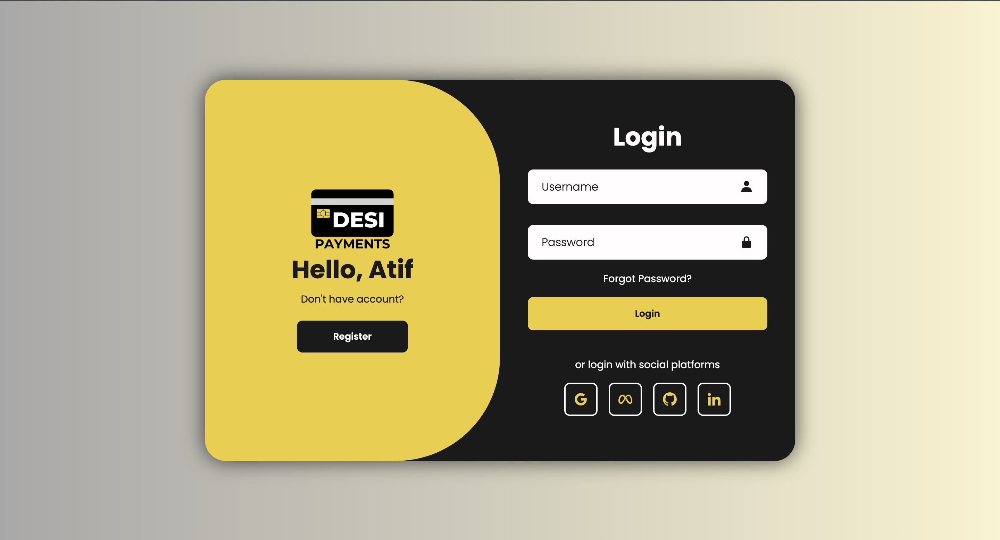

#Register Page

A modern and responsive login/registration interface with smooth transitions and social auth options.


## Features

- Toggle between Login & Register forms
- Responsive design (works on mobile devices)
- Social login icons (Google, Meta, GitHub, LinkedIn)
- Animated notification system with progress bar
- Smooth transition effects
- Password recovery option
- Clean and modern UI
- Cross-browser compatible

## Technologies Used

- HTML5
- CSS3 (Flexbox, CSS Variables, Media Queries)
- Vanilla JavaScript
- [Boxicons](https://boxicons.com/) for icons
- Google Fonts (Poppins)

## Installation

1. Clone the repository:
   ```bash
   https://github.com/MohammadAtifHossain/Login-Register-forms.git

## This README includes:
- Project overview
- Key features
- Technology stack
- Setup instructions
- Customization guide
- Dependency information
- Licensing details
- Contribution guidelines

You might want to:
1. Add a project screenshot and replace `screenshot.png`
2. Update the license file if needed
3. Modify the social media links to actual endpoints when implemented
4. Add any additional deployment instructions specific to your environment
# Login-Register-forms
